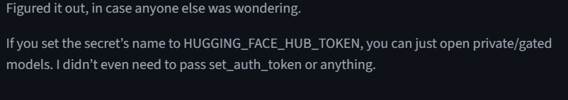

# RAG Project with Gradio Interface

This project implements a Retrieval-Augmented Generation (RAG) system using LangChain and Hugging Face models. It allows users to upload a PDF, process it, and ask questions based on the content.

## Features
- PDF text extraction and chunking.
- Hypothetical Document Embedding (HyDE) for improved retrieval.
- Gradio interface for easy interaction.

## Setup
1. Clone the repository:
   ```bash
   git clone https://github.com/your-username/RAG_Project.git
   cd RAG_Project
2. Install dependencies:
    ```bash
    pip install -r requirements.txt
3. Create a .env file and add your Hugging Face API token:
    HUGGINGFACE_HUB_TOKEN="your_huggingface_token_here"
4. Run the application:
    python app.py


